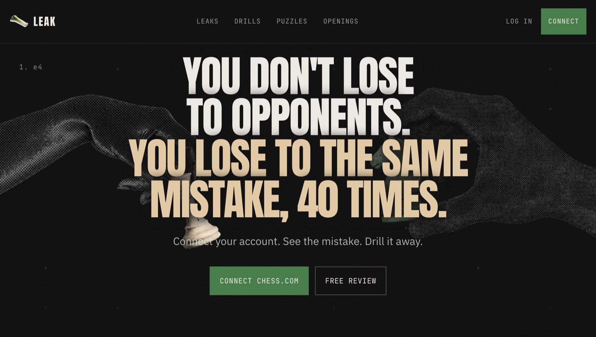
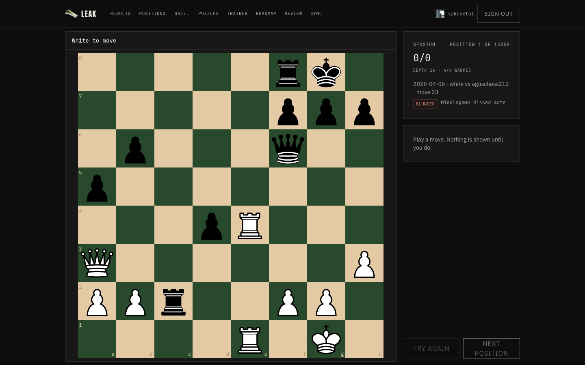
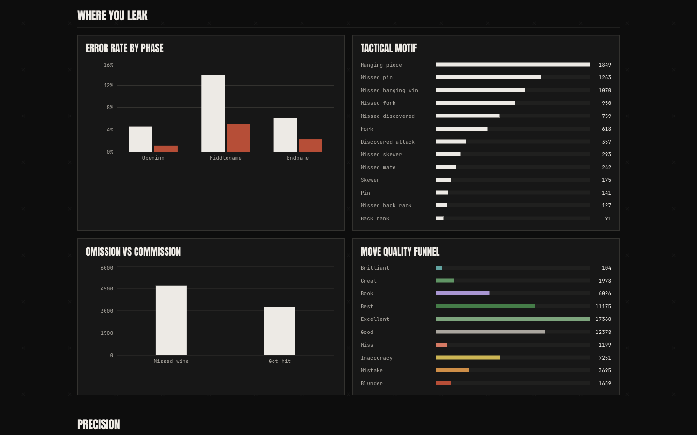
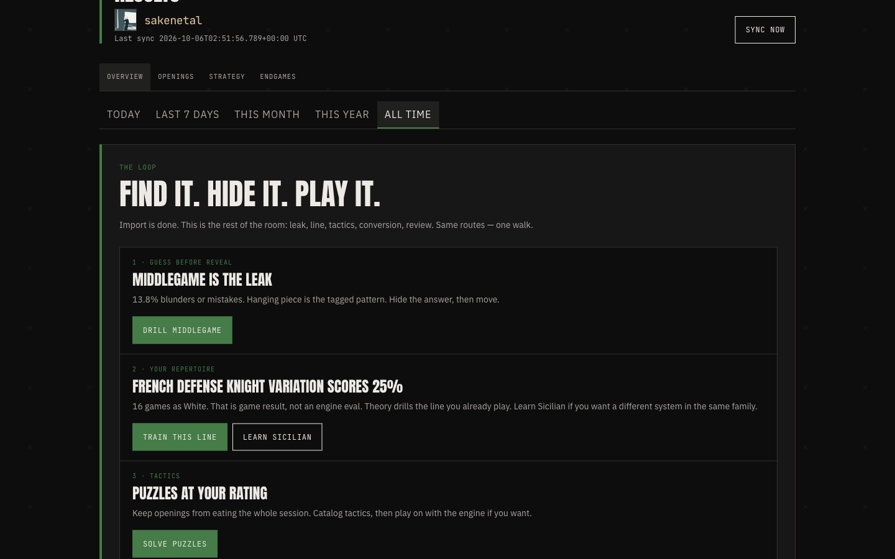
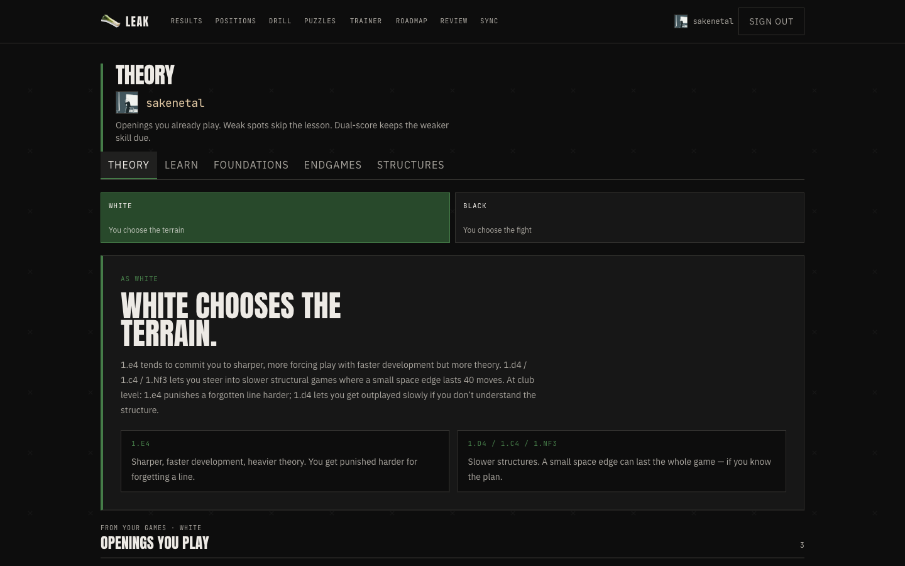

# LEAK

A training site around a Chess.com account, not a playing site. Chess.com hosts the games. LEAK scores them, keeps the moves that drop your win chance, and makes you play the position before it shows the engine line.

Live: [chess-website-six.vercel.app](https://chess-website-six.vercel.app)





| Where the rating leaks | What to do next |
|---|---|
|  |  |

Opening trainer:



Screenshots are the signed-in library for the public Chess.com account `sakenetal`.

## Architecture

```
Chess.com public API
  → server function (product User-Agent, backoff)
  → browser Web Worker
       Stockfish 18 Lite WASM
       if WASM fails to compile, remember that and use the ASM.js build
  → Postgres (Supabase)
       game summaries + flagged positions (inaccuracy, mistake, blunder)
       the PGN is not stored
       a review tape stays in memory and is not written
  → results, drill, opening trainer, puzzles
```

The first import runs in the browser. A Vercel cron at 06:00 UTC (`/api/sync-user`) only analyzes games after `sync_state.last_game_end_time`.

Library scoring uses a win-percentage drop per move, and RMS for game, strategy, and endgame aggregates. Stockfish searches 12,000 nodes with MultiPV 4. The drill board uses a separate depth-16 search so the guess stays interactive.

Row-level security lets anyone read analysis by username. Writes (sync, drill attempts, opening progress, linking a username) require the signed-in user whose Chess.com account matches the route. The client cannot pick someone else's username.

## Where the interesting code is

- Analysis budget and engine fallback: [`src/lib/analysis/engine.ts`](src/lib/analysis/engine.ts)
- Worker: [`src/workers/analyze.worker.ts`](src/workers/analyze.worker.ts)
- Sync: [`src/lib/sync/runSync.ts`](src/lib/sync/runSync.ts)
- Daily cron: [`src/routes/api/sync-user.ts`](src/routes/api/sync-user.ts)
- Drill board: [`src/components/DrillBoard.tsx`](src/components/DrillBoard.tsx)

Longer write-up, with diagrams: [`docs/humans/Architecture.md`](docs/humans/Architecture.md). Open the `docs/` folder as an Obsidian vault. Agent notes start at [`docs/llm/INDEX.md`](docs/llm/INDEX.md).

## Setup

1. Copy `.env.example` to `.env.local`.
2. Set `VITE_SUPABASE_URL` and `VITE_SUPABASE_ANON_KEY`.
3. For the daily cron, also set `SUPABASE_SERVICE_ROLE_KEY` and `CRON_SECRET` (same values in the Vercel project).
4. In the Supabase dashboard, add `http://localhost:3000/auth/callback` and the production callback under Authentication → URL configuration.
5. Apply the SQL in `supabase/migrations/` if this is a new project.

```bash
npm install
npm run dev
```

Open [http://localhost:3000](http://localhost:3000).

`npm test` runs the unit tests. The Lichess puzzle dump is optional: `npm run puzzles:import-full`.

## License

Personal project. There is no open-source license. All rights reserved.
