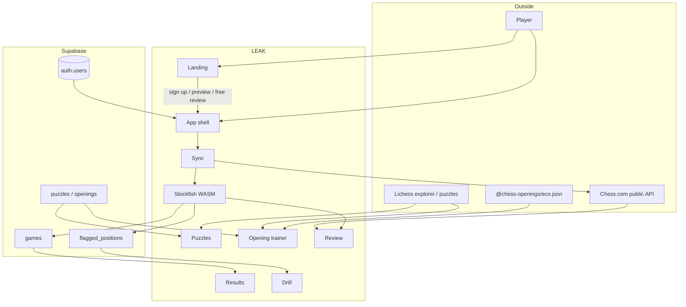
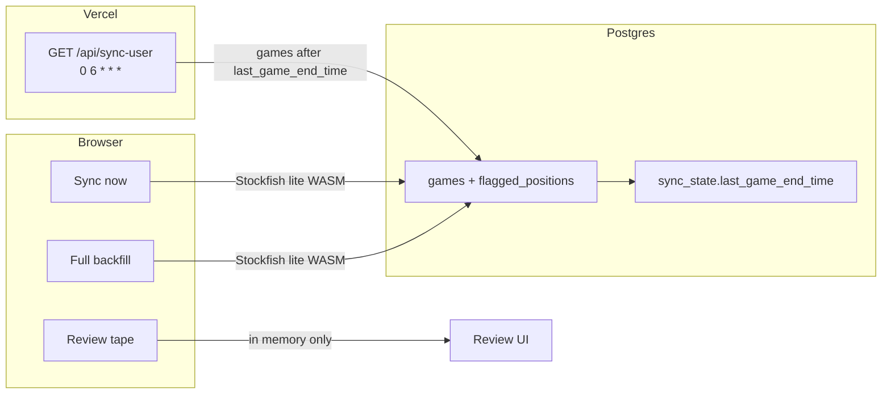
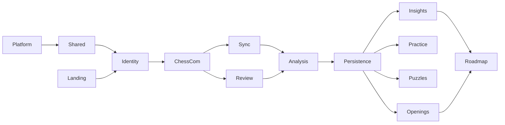

---
tags:
  - audience/human
  - map
aliases:
  - System architecture
---

# Architecture

LEAK is a TanStack Start app. Players bring a Chess.com library. The browser (and a thin daily cron) run Stockfish, persist **aggregates + leak positions** to Supabase, and teach from those leaks. Full move tapes are for [[Review]] only and never hit the database.

## Workload split

Heavy work lives in the player's browser on purpose. Vercel Hobby cron is a short incremental pass, not a library rebuild.

## Domain graph

Arrows mean “this domain depends on that one.” Keep new features inside one domain unless the arrow already exists.

Jump: [[Platform]] · [[Shared]] · [[Identity]] · [[Chess.com]] · [[Sync]] · [[Analysis]] · [[Persistence]] · [[Insights]] · [[Practice]] · [[Puzzles]] · [[Openings]] · [[Review]] · [[Roadmap]] · [[Landing]]
