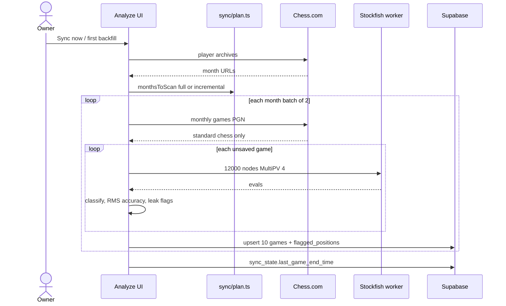
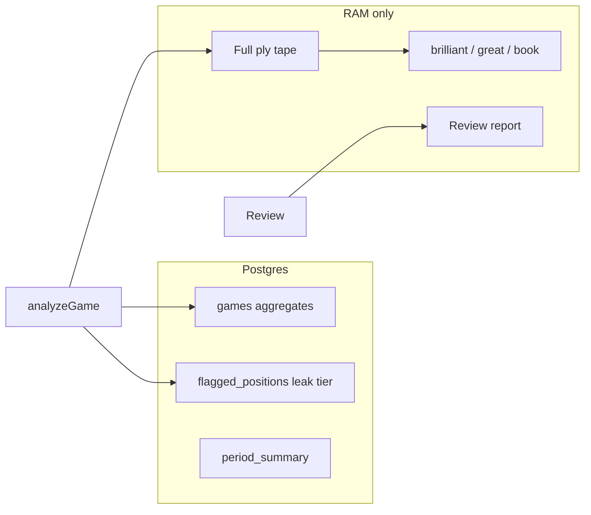
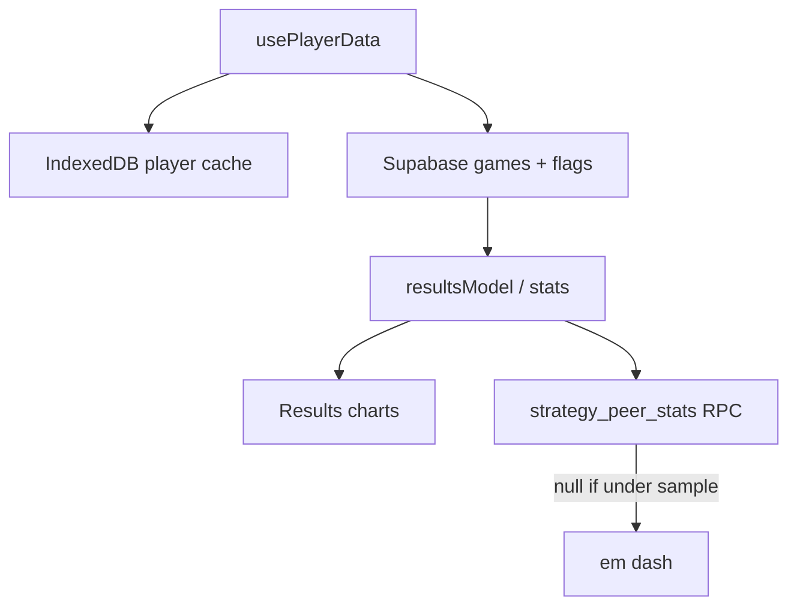

---
tags:
  - audience/human
  - map
aliases:
  - How data moves
---

# Data flow

## Library ingest

Owner hits Analyze / Sync now, or cron wakes `/api/sync-user`.

Retention is a rolling **two years**. Purge runs best-effort before sync and does not block ingest.

## What gets stored vs what dies in memory

`FlaggedPosition` is the leak tier used by [[Practice]]. Cosmetic labels never enter drills.

## Read path for Results

Peer cohorts exist for Strategy and Endgames. Openings have **no** similar-rating column — a blank column would look like missing data.
