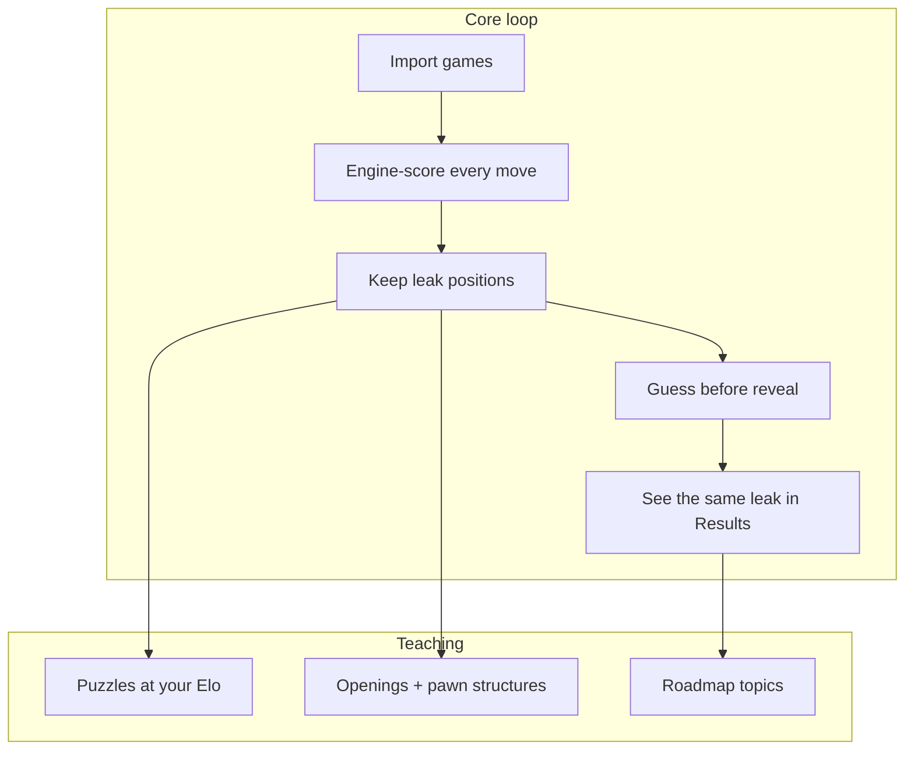

---
tags:
  - audience/human
  - map
aliases:
  - What the product is
---

# Product map

LEAK is not a playing site. It is a **training room** around a Chess.com account: find the leak, hide the answer, make the player move.

## Surfaces

| Surface | Route | Job |
| --- | --- | --- |
| Landing | `/` | Convert logged-out visitors. Linked users skip this. |
| Results | `/results/$username` | Where rating leaks: overview, openings, strategy, endgames |
| Positions | `/positions/$username` | Browsable leak table |
| Drill | `/drill/$username` | Guess-before-reveal on **your** mistakes |
| Puzzles | `/puzzles/$username` | Catalog tactics at rating |
| Trainer | `/trainer/$username` | Repertoire recall + ideas, then structures |
| Roadmap | `/roadmap/$username` | Named topics with real study positions |
| Review | `/review/$username` | One-off Chess.com-style tape, **not stored** |
| Analyze | `/analyze/$username` | Owner backfill / sync now |

Public username URLs are readable without signing in. Writes (sync, drill attempts, opening progress, username link) require the bound owner.

## What is never the product

- A chess server or matchmaking
- Storing PGN of the library
- Persisting Review tapes
- Invented evals or explorer frequencies on opening lesson cards
- Completing roadmap nodes because someone played games
