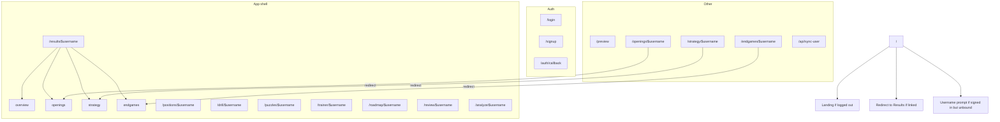

---
tags:
  - audience/human
  - map
aliases:
  - Routes
---

# Route map

TanStack Router, file routes under `src/routes/`. `$username` is the Chess.com handle, not the auth uuid.

| Path | File | Notes |
| --- | --- | --- |
| `/` | `src/routes/index.tsx` | Marketing or redirect |
| `/login` `/signup` | `login.tsx` `signup.tsx` | Password forms; README still says magic link |
| `/auth/callback` | `auth.callback.tsx` | PKCE code exchange |
| `/results/$username` | `results.$username.tsx` + nested | Overview / openings / strategy / endgames |
| `/positions/$username` | `positions.$username.tsx` | Flagged table → drill deep links |
| `/drill/$username` | `drill.$username.tsx` | Guess-before-reveal |
| `/puzzles/$username` | `puzzles.$username.tsx` | Catalog tactics |
| `/trainer/$username` | `trainer.$username.tsx` | Openings + structures tabs |
| `/roadmap/$username` | `roadmap.$username.tsx` | Study map |
| `/review` `/review/$username` | `review.tsx` | Ephemeral tape |
| `/analyze/$username` | `analyze.$username.tsx` | Owner sync UI |
| `/preview` | `preview.tsx` | Live product proof, fixed player |
| `/api/sync-user` | `api/sync-user.ts` | Cron + `CRON_SECRET` |

Nav in [[Shared]] lives in `AppShell`: Results, Positions, Drill, Puzzles, Trainer, Roadmap, Review. Owner-only: Analyze / Sync.
