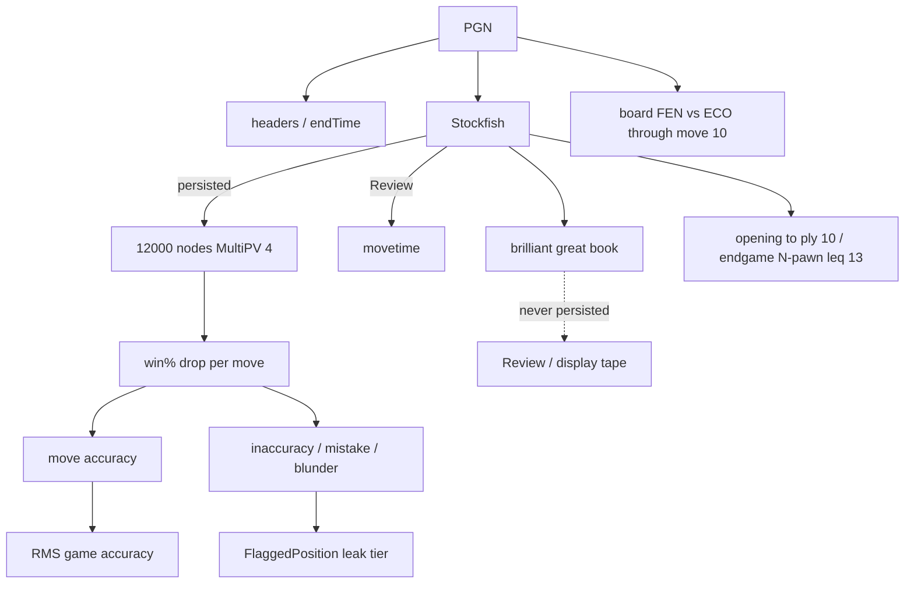

---
tags:
  - audience/human
  - domain/analysis
aliases:
  - Engine
  - Stockfish
---

# Analysis

Stockfish scores a game. Persist **aggregates + leak flags**. Keep brilliant/great/book and the full ply tape in memory.

## Owns

- `src/lib/analysis/*`, `src/lib/analyzeClient.ts`
- `ANALYSIS_VERSION` in `types.ts` (currently `1`)

## Depends on

[[Platform]] (engine assets) · [[Chess.com]] (PGN, endTime)

## Scoring

Move accuracy comes from **winning-chance drop**, not raw ACPL. Game / strategy / endgame aggregates use **RMS**. Arithmetic mean reads about 5–15 points high versus Chess.com.

## Engine fallbacks

WASM worker → remember WASM failure → ASM. Worker unavailable → main thread.

## Downstream

[[Persistence]] stores the aggregates. [[Practice]] reads leak flags. [[Insights]] charts drop mate-inflated outliers. [[Review]] sets `includePlies` and never writes.
