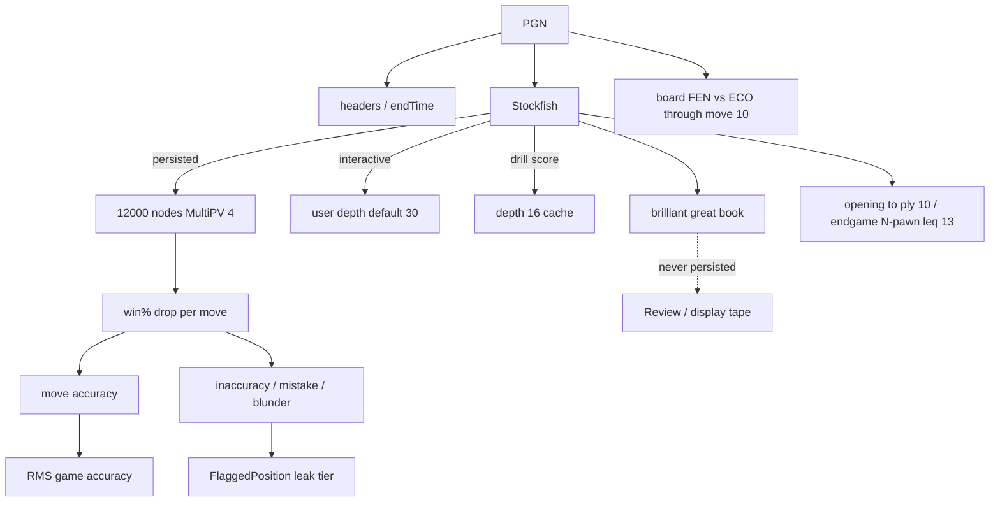

---
tags:
  - audience/human
  - domain/analysis
aliases:
  - Engine
  - Stockfish
---

# Analysis

Stockfish scores a game. Persist **aggregates + leak flags**. Keep brilliant/great/book and the full ply tape in memory.

## Owns

- `src/lib/analysis/*`, `src/lib/analyzeClient.ts`
- `ANALYSIS_VERSION` in `types.ts` (currently `1`)

## Depends on

[[Platform]] (engine assets) · [[Chess.com]] (PGN, endTime)

```mermaid
flowchart TB
  PGN[PGN] --> Meta[headers / endTime]
  PGN --> Engine[Stockfish]
  Engine -->|persisted| Nodes[12000 nodes MultiPV 4]
  Engine -->|interactive| Depth[user depth default 30]
  Engine -->|drill score| DrillD[depth 16 cache]
  Nodes --> Win[win% drop per move]
  Win --> Acc[move accuracy]
  Acc --> RMS[RMS game accuracy]
  Win --> Class[inaccuracy / mistake / blunder]
  Class --> Flags[FlaggedPosition leak tier]
  Engine --> Cosmetic[brilliant great book]
  Cosmetic -.->|never persisted| UI[Review / display tape]
  PGN --> ECO[board FEN vs ECO through move 10]
  Engine --> Phase[opening to ply 10 / endgame N-pawn leq 13]
```

## Scoring

Move accuracy comes from **winning-chance drop**, not raw ACPL. Game / strategy / endgame aggregates use **RMS**. Arithmetic mean reads about 5–15 points high versus Chess.com.

## Engine fallbacks

WASM worker → remember WASM failure → ASM. Worker unavailable → main thread.

Interactive analysis (Review arrows, puzzle/drill play-on) uses a **depth tuner** (default 30) with live `Stockfish 18 Lite · depth n/max` text and suggestion arrows. That search is not written to Postgres and does not change `ANALYSIS_VERSION`. Drill **scoring** stays a separate depth-16 cache.

## Downstream

[[Persistence]] stores the aggregates. [[Practice]] reads leak flags. [[Insights]] charts drop mate-inflated outliers. [[Review]] sets `includePlies` and never writes.
