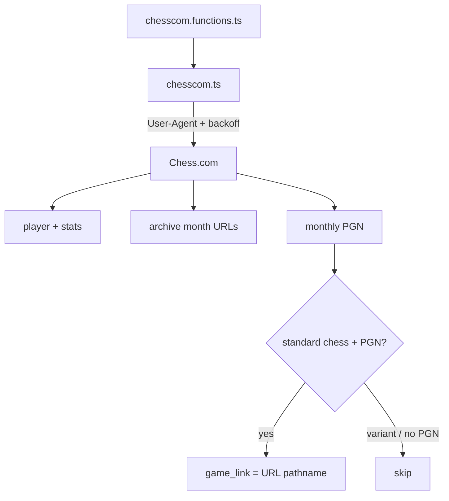

---
tags:
  - audience/human
  - domain/chesscom
aliases:
  - Chess.com API
---

# Chess.com

Public player / stats / archives / monthly games. All calls go through TanStack server functions so the product User-Agent stays on the server.

## Owns

- `src/lib/chesscom.ts`, `chesscom.functions.ts`
- Game identity: pathname of the Chess.com URL
- PGN header parse (regex, not chess.js at module top)

## Depends on

[[Platform]]

## Identity and dates

`(username, game_link)` is the upsert key. Prefer Chess.com `endTime` over PGN `[Date]` — daily games keep the start date in those headers.

Primary rating for puzzles: blitz, then rapid, bullet, daily.

Used by [[Sync]], [[Review]], [[Identity]] avatars, [[Puzzles]] Chess.com source.
