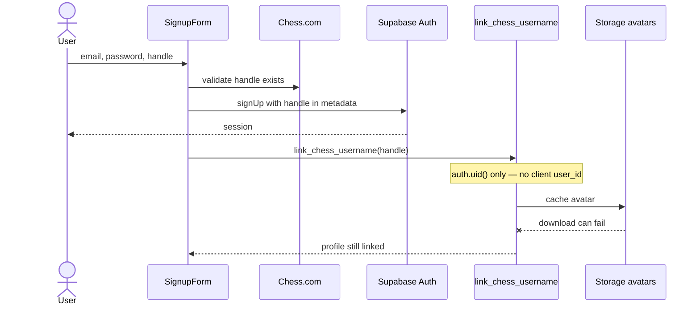

---
tags:
  - audience/human
  - domain/identity
aliases:
  - Auth
---

# Identity

Email/password session, then exactly one Chess.com username bound through `auth.uid()`. Avatars are cached in Storage but must not fail the link.

## Owns

- `src/lib/auth.tsx`, `profile.ts`, `avatar.ts`, `avatar.server.ts`
- `src/routes/login.tsx`, `signup.tsx`, `auth.callback.tsx`
- `profiles` table, RPCs `link_chess_username`, `linked_username`

## Depends on

[[Platform]] · [[Chess.com]] (handle + avatar URL)

## Invariants

- Client never supplies `user_id` to the link RPC.
- Owner actions (sync, persist drills, save openings) only when route username equals `profiles.chess_com_username`.
- README still mentions magic-link; forms are passwords. Treat README as stale on this point.
