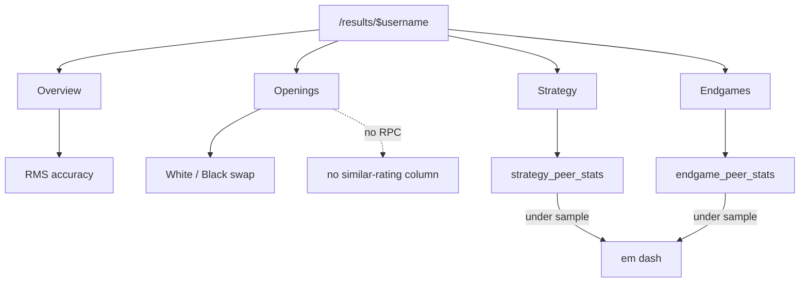

---
tags:
  - audience/human
  - domain/insights
aliases:
  - Results
---

# Insights

Results is the information architecture for “where do I leak?” One top-level nav item, four nested sections.

## Owns

- `src/routes/results.$username*.tsx`
- `src/lib/resultsModel.ts`, `stats.ts`, `strategyStats.ts`, `grades.ts`
- `src/components/ResultsCharts.tsx`, `InsightStats.tsx`, `OpeningRepertoire.tsx`, `StrategyInsights.tsx`, `EndgameInsights.tsx`

## Depends on

[[Persistence]] · [[Analysis]] · [[Shared]] (charts)

## Aggregation

RMS for game / strategy / endgame. Openings may fall back to ACPL on legacy rows. Filters normalize to Overall, Bullet, Blitz, Rapid, Daily, Other — same class goes into peer RPCs.

Letter grades: accuracy 90/85/78/70/60 → A+ through D, else F. Conversion grades depend on better / equal / worse entry (see `grades.ts`).

Charts skip unanalyzed or mate-inflated rows (`usableAccuracy` / `usableAcpl`) so a 0% / 5000-ACPL game cannot flatten the series.

Review's synthetic 5–95 percentile is **not** this domain.
