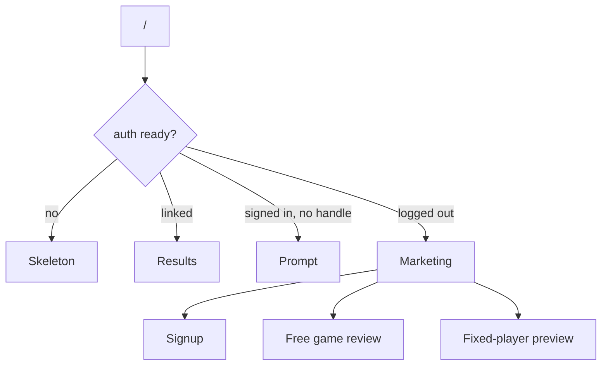

---
tags:
  - audience/human
  - domain/landing
aliases:
  - Marketing
---

# Landing

Logged-out `/` is a standalone marketing page. Linked users never see it — they go to Results. Signed-in but unbound users get the username prompt in the app shell.

## Owns

- `src/components/landing/*`
- `src/routes/index.tsx`, `preview.tsx`
- `src/components/HeroPosition.tsx`, `PreviewErrors.tsx`

## Depends on

[[Identity]] · [[Review]] (free review CTA) · [[Shared]] (product proof widgets)

## Motion

Hero parallax is CSS `perspective` / `translateZ` — no scroll listeners. Italian position on the board; selected pieces lift as “the leaks.” Reduced motion flattens parallax; reduced transparency drops glass.

Product chrome ([[Shared]]) now uses the same training-room tokens as the rest of the app. Landing may still carry extra marketing CSS — do not fork a second design system inside authenticated routes.
