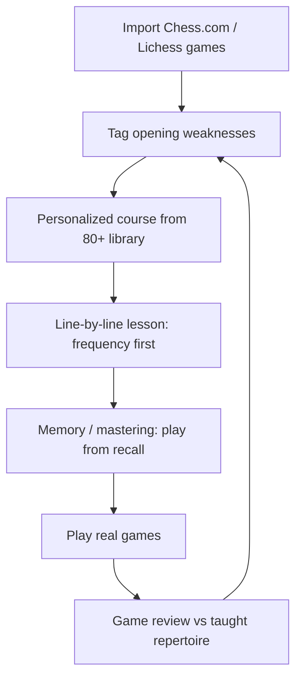

---
tags:
  - audience/human
  - domain/openings
aliases:
  - Lotus Chess research
---

# Lotus Chess — research and LEAK mapping

This note is the product brief for importing Lotus Chess *behaviors* onto LEAK. It does not copy their assets, copy, or course trees. Implementation stays on existing LEAK tables, routes, and provenance rules.

Public sources: [lotus-chess.com](https://www.lotus-chess.com/), App Store / Play listings, founder bios (Raphael and Maxim Nitsche), user reviews. Where the app does not publish an algorithm, this note says **inferred**.

## What Lotus is

Lotus Chess is a mobile chess trainer (iOS/Android) positioned as a complete improvement loop: openings, tactics puzzles, foundations, endgames, and game reviews. Founders Raphael (≈2116) and Maxim (≈1916) Nitsche previously built MATH 42 (adaptive math tutor, later acquired). The product language is Duolingo-like: short sessions, streaks of familiarity, “workouts” for memory.

Claimed scale (marketing, not independently audited): 250k+ learners, 80+ opening courses, 100k+ puzzles, 60+ endgame lessons, 180+ practice positions, analysis of up to 3,000 of *your* games, and a proprietary model trained on 100M+ amateur games.

The wedge vs Chessable / Chess.com Lessons: **beat humans, not Stockfish**. When two moves are engine-close, Lotus picks the one with the better **human win rate**. Courses emphasize “crushing lines” against common amateur mistakes, not GM encyclopedias that never appear at the user’s rating.

## The loop they sell

That is the same loop LEAK already has in pieces (sync → flags → drill / trainer / review). Lotus packages it as one home screen and biases opening *choice* toward amateur win rate instead of engine principal variation.

## Feature map (theirs → ours)

| Lotus home | What it actually trains | LEAK already | Additive import |
| --- | --- | --- | --- |
| Puzzles | Rating/theme tactics, pattern recognition | `/puzzles/$username` catalog | Keep. Do not replace with position drills. |
| Openings — *your* repertoire | Spaced review of lines you play; “weak spots” from your games | Trainer dual-score (`recall_ease` / `understanding_ease`), Results openings | **Theory** track: only openings you play. Weak-spot drills skip the lesson. |
| Openings — *learn a new one* | Pick a named system, walk the mainline + common sidelines, then master from memory | Download + `OpeningLesson` + foundations session (ply order + explorer frequency) | **Learn** track: Lotus-shaped copy and **master** session (longer, from move 1). Still PGN/ECO + explorer + authored/template reasons — no invented evals. |
| Foundations | Beginner curriculum: ideas before a full repertoire | `/roadmap/$username` (tactics → openings → structures → endgames). Playing a game does not mark a node done. | Trainer **Foundations** tab links the roadmap. Do not auto-complete from games. |
| Endgames | 60+ lessons, then convert vs a human-like engine | Roadmap endgame track + flagged `phase=endgame` drills + Results endgames | Trainer **Endgames** tab: drill leaked endings, jump to the track and Results. Play-vs-engine conversion is a later add, not a rewrite of analysis. |
| Game reviews | Replay your games, mark where you left the taught line | `/review/$username` (ephemeral ply tape, never persisted) | Keep Review. Opening *deviation vs taught tree* is already trainer + Results; do not persist Review tapes. |
| Personalized plan | “Your London scores badly; train this instead” | Flagged positions, Results win rates, explorer frequencies on nodes | Learn track prefers explorer frequency. Theory still schedules from `min(recall, understanding)`. |

## Why it feels effective

Lotus is not magic AI. It stacks known learning mechanics on opening trees.

**1. Generation effect (guess before reveal).** Recalling a move from a board is harder than reading a PGN, and that difficulty is the point. Chessable MoveTrainer, Anki, and LEAK drills all use this. Lotus’s “mastering” mode is the same: you replay the line from memory instead of tapping Next.

**2. Frequency-first encoding.** You see the replies you will actually face at your rating, not a 0.2% GM sideline. That matches how club games are decided. LEAK already expands explorer replies at ≥1.5% in a ±100 rating band. Lotus markets this as “100M games”; we already have Lichess explorer (club + masters) with provenance kept off explanation prose.

**3. Desirable difficulty + spacing.** Repeating a line until it is “natural,” then coming back later, is informal spaced repetition. Chessable/ChessAtlas publish FSRS/SM-2. Lotus does **not** advertise a named scheduler in public copy; reviews describe repetitive training and a mastering pass. LEAK’s dual-score scheduler is stricter and should stay: the weaker of recall vs understanding keeps a node due.

**4. Personalization from real games.** Importing 3,000 games answers “what do *I* mess up?” instead of “what does a course author like?” LEAK already flags inaccuracy/mistake/blunder from the user’s library. Lotus then *rewrites the recommended move* using amateur WR. That second step is why their course can disagree with Stockfish *and* with the user’s current repertoire.

**5. Interleaving of skills.** Puzzles + openings + endgames in one app reduce “I only study openings.” LEAK already has those routes in AppShell. The import is IA (trainer tracks), not a new engine.

**6. Affect.** Short sessions, offline lessons, “crushing” copy. That is motivation design from MATH 42, not chess theory. Keep LEAK’s training-room voice; do not paste Lotus marketing into cards.

## Why Lotus calls *your* openings bad

This is the part that feels personal. Several layers get collapsed into “your opening is bad.”

**A. Branch win rate, not engine eval.** If you score 42% in a line you play 40 times, Lotus treats that branch as a leak even if Stockfish says 0.00. Results already show this on `/results/$username/openings` (White/Black lists, no peer column). Theory training should fix *your* moves in that branch. Learn training may offer a *different* system that scores better for amateurs.

**B. Tie-break toward human WR.** Marketing: when two moves are engine-close, pick the higher win-rate move. Example of the user’s drill bug in reverse: Stockfish at low depth flips `h3`/`h4`; Lotus would freeze one answer using a database vote. That is why their taught move can look “worse” on a 150ms eval and “better” in games.

**C. Deviation from the taught tree.** After you “learn the Lotus London,” any move you play that is not in *their* tree is a mistake in the app, even if it is a valid book move. ChessAtlas names this deviation detection. LEAK should keep two notions separate: (1) engine leak on a flagged FEN, (2) repertoire miss vs *our* `opening_nodes`. Do not mix them in one badge.

**D. Attacking bias.** Lotus prefers lines that punish common amateur errors. Quiet, equalizing theory (Berlin, many Caro lines) looks “passive” in their UI. That is a style choice, not a proof the user’s opening is unsound. LEAK must not invent “this opening is bad” evals on knowledge cards. Statistics stay on explorer/evidence fields.

**E. Sample-size and time-control noise.** Bullet WR is not classical WR. A “bad” opening on 200 bullet games may be fine in rapid. LEAK already stores `time_class` on flags; keep that split when talking about opening performance.

**F. Engine-depth flicker (LEAK-specific pain).** Position drills used a short movetime search *after* the guess. `h4` then `h3` then `h4` is not pedagogy — it is an unstable PV. Lotus avoids this by committing to a course move. LEAK’s fix for **puzzles-from-positions** is a **depth** search, cached, prefetched a few positions ahead, with MultiPV near-equals accepted. That is independent of Lotus WR.

## How they likely implement it (inferred)

Not open source. Reasonable reconstruction from product behavior + standard chess-app architecture:

1. **Ingest.** Chess.com / Lichess APIs → PGN → opening classification (ECO / hash of first N moves). Same job as LEAK sync, except they keep more opening-tree state than our game aggregates.
2. **Repertoire graph.** Node = FEN (or Zobrist) after each ply; edge = SAN + stats (games, WR, rating band). Course authors (or a generator) mark *your* move vs *their* move.
3. **LotusAI move pick.** For each node, take Stockfish MultiPV, drop moves worse than ~0.2–0.4 pawns (inferred threshold), rank survivors by amateur WR from the 100M corpus, pick #1. That single move becomes the flashcard answer.
4. **Teaching UI.** Line-by-line: opponent plays the most common reply; you play the committed move. Sidelines unlock by frequency. “Mastering” jumps to a random interior node (reviews complain there is no “show last three moves”).
5. **Explanations.** Public reviews (2025–2026) say reasons are thin or missing; founders replied they plan concept text. LEAK already requires reason tags and evidence-backed templates. **Do not copy their “just memorize” failure.** Learn track still uses lessons + why-MCQ.
6. **Endgames.** Authored lesson sequence + practice FENs vs a capped / “human-like” engine (likely reduced strength, not full MultiPV 4 at 12k nodes). LEAK can reuse roadmap study FENs + leak drills first.
7. **Puzzles.** Large imported catalog (Lichess-style). LEAK already merges catalog + seed + on-demand.
8. **Offline.** Packaged course JSON on device. LEAK courses are resumable client jobs + Supabase packs keyed by opening + side + rating band + generator version.

We do **not** scrape Lotus courses, copy their move trees, or call a paid AI API for explanations.

## Memory: what to copy, what to reject

Copy:

- Teach the line in order (foundations / master), then shuffle later (weak-spot / due scheduler).
- Opponent replies sorted by how often they happen at this rating.
- A second “from memory” pass after the idea lesson.
- Keep answers stable for a session (no PV flicker).

Reject:

- Memorize with no why. LEAK `MUST` train only nodes with ≥1 validated reason tag.
- Invent evals or frequencies in prose.
- Treat explorer-only nodes as drillable.
- Replace dual-score scheduling with “repeat until bored.”
- One mega-component with `isLotus` booleans. Two tracks, same `OpeningLesson` / `buildSession`.

## Game analysis: theirs vs ours

Lotus “in-depth analysis of your online games” is a **training funnel**: find opening mistakes → queue those positions. LEAK analysis is a **library scorer**: 12,000-node MultiPV 4, win%-drop accuracy, RMS aggregates, leak tiers only on inaccuracy/mistake/blunder. Review is a separate ephemeral movetime path.

Keep that split. Do not persist Review ply tapes. Do not put brilliant/great/book on drills. Position-drill depth search is **interactive only** and must not rewrite `ANALYSIS_VERSION` or stored flags.

## Endgames and foundations

Lotus endgames work because they are a **curriculum** (KQ vs K, Lucena, then convert) plus **play**. LEAK already has the curriculum (roadmap endgame nodes with study FENs) and the personal leaks (`phase=endgame`). The import is a trainer tab that points at both. A “human-like engine” play-out can sit on top of `evaluateFen` later; it is not required to ship the IA.

Foundations in Lotus are the MATH 42 instinct: do not start with the Najdorf. LEAK roadmap already starts at hanging pieces. Trainer Foundations is a doorway, not a second map.

## What we will not do

- Rewrite sync, analysis, or puzzle catalog.
- Store PGN or Review tapes.
- Publish imported PGN commentary into the shared catalog.
- Claim Lotus WR as engine truth.
- Auto-complete roadmap nodes because the user played the opening.

## Sources

- https://www.lotus-chess.com/
- Apple App Store / Google Play listing copy (openings, endgames, puzzles, 3000-game import, 100M-game AI, offline lessons)
- App Store user reviews: mastering/flashcards praised; “no why,” “random interior node,” missing cross-device sync criticized
- Founder background: MATH 42, Deep; Elo figures from the marketing site
- Adjacent trainers for contrast: Chessable MoveTrainer, Chessbook, ChessAtlas deviation + FSRS (ChessAtlas comparison posts are competitor-authored)

Last reviewed: 2026-09-01.

## Shipped on LEAK (tracker)

Keep this list honest. Checked items are in the repo; unchecked stay out of scope or later.

- [x] Theory vs Learn trainer tracks (played repertoire vs named line + master memory)
- [x] Foundations / Endgames trainer doorways (roadmap + leaked endings) — not a second map
- [x] Frequency-first explorer replies on generated courses (≥1.5%, ±100 rating)
- [x] Dual-score scheduler stays `min(recall, understanding)` — not Lotus “repeat until bored”
- [x] Drill answers frozen at depth 16 + prefetch (no `h4`/`h3` flicker)
- [x] Results openings ranked by volume-weighted score leak (game WR, not engine)
- [x] Chess.com-style analysis mode after puzzles/drills + Review depth tuner (default 30, arrows, live engine name/depth)
- [ ] Amateur WR tie-break for *taught* opening moves (LotusAI). Explorer frequency is the current proxy. Do not invent WR on knowledge cards.
- [ ] Human-like engine for endgame conversion play-out
- [ ] Cross-device lesson packs beyond existing `opening_packs`

Interactive analysis skill: `.agents/skills/chesscom-analysis-board/SKILL.md`.
