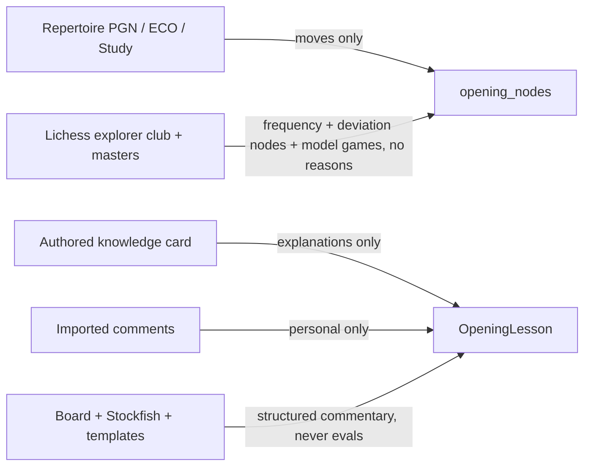
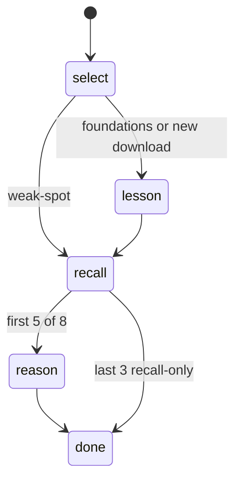

---
tags:
  - audience/human
  - domain/openings
aliases:
  - Opening trainer
---

# Openings

Repertoire trainer: remember the move, then say why. Foundations and downloads teach a Pawnbreak-shaped lesson first. Weak-spot drills skip the lesson.

## Owns

- `src/lib/openings/*`
- `src/components/OpeningTrainer.tsx`, `OpeningChooser.tsx`, `OpeningLesson.tsx`, `PawnStructureLab.tsx`
- `openings`, `opening_nodes`, `node_progress`, `structure_targets`, `opening_generation_jobs`, `opening_explorer_cache`, `opening_packs`
- scripts: `openings:seed`, `openings:import`, `openings:explorer`

## Depends on

[[Persistence]] · [[Chess.com]] (played openings) · Lichess explorer (server) · eco.json (server)

## Provenance — do not mix

Vienna Game is the teaching quality bar. Downloaded encyclopedia lines get a playable starter immediately, then a resumable job fills evidence-backed explanations. Never invent evals or explorer frequencies on a card. Never copy commercial course prose.

## Session

Dual score: `recall_ease` and `understanding_ease`. Due date uses `min` of the two — the weaker skill keeps the node due.

Trainable nodes: user's repertoire moves with ≥ 1 validated reason tag. Explorer-only nodes are not drilled.

Search: club nicknames (Dragon, Spanish, fried liver). One shared `downloadingKey` so only the clicked row says Downloading.

## Structures

Second trainer tab. Identity is the **pawn-only FEN**. Fuzzy match must/absent pawn squares. Games tag by opening name/ECO (no stored PGN); leak FENs tag the skeleton. Roadmap deep-links `?tab=structures&structure=`.
