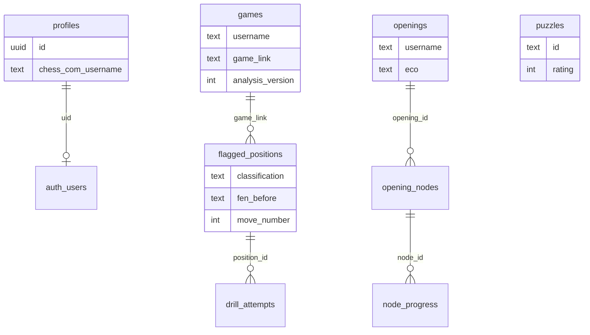

---
tags:
  - audience/human
  - domain/persistence
aliases:
  - Supabase
  - Database
---

# Persistence

Supabase Postgres + RLS. Public **reads** of analysis for username preview. Owner **writes** when `username = linked_username()`. Shared catalogs (puzzles, seeded openings) are readable by all and written with the service role.

## Owns

- `src/lib/supabase/*`, `src/lib/persist.ts`
- `src/lib/playerCache.ts`, `idbCache.ts`
- `supabase/migrations/*`

## Depends on

[[Identity]] · [[Analysis]] (row shape)

## Tables

`profiles` · `games` · `flagged_positions` · `drill_attempts` · `period_summary` · `sync_state` · `puzzles` · `openings` · `opening_nodes` · `node_progress` · `structure_targets`

RPCs: `link_chess_username`, `linked_username`, `purge_expired_games`, `normalize_time_class`, `strategy_peer_stats`, `endgame_peer_stats`.

## Client cache

Versioned IndexedDB for player payloads. Quota / private-mode failures are ignored so the app still runs.

Persist in 200-row chunks. Refresh flagged rows by game link. `analysis_version` missing or old → eligible for reanalyze.

**Not stored:** library PGN, Review move tape, cosmetic move labels.
