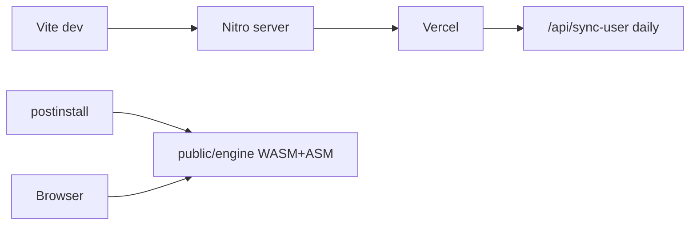

---
tags:
  - audience/human
  - domain/platform
aliases:
  - Stack
---

# Platform

TanStack Start (Router + Query), Vite, Nitro, React 19. Hosted on Vercel. Stockfish 18 lite ships in `public/engine` via `scripts/copy-engine.mjs` on `postinstall`.

## Owns

- `package.json`, `vite.config.ts`, `vercel.json`
- `src/router.tsx`, `src/routes/__root.tsx`
- Engine copy script
- Env: `VITE_SUPABASE_*`, `SUPABASE_SERVICE_ROLE_KEY`, `CRON_SECRET`, `CHESSCOM_USER_AGENT`

## Depends on

Nothing inside the product. Everything else depends on this.

## Runtime split

| Where | What |
| --- | --- |
| Browser | Full backfill, Sync now, Review tape, trainer UI |
| Server functions | Chess.com fetch, ECO search, puzzle catalog writes, avatar fetch |
| Vercel cron | Incremental analysis after `sync_state.last_game_end_time` |
| Postgres | Rows, RLS, peer RPCs, purge |

See [[Architecture]] for why backfill is not on the cron.
