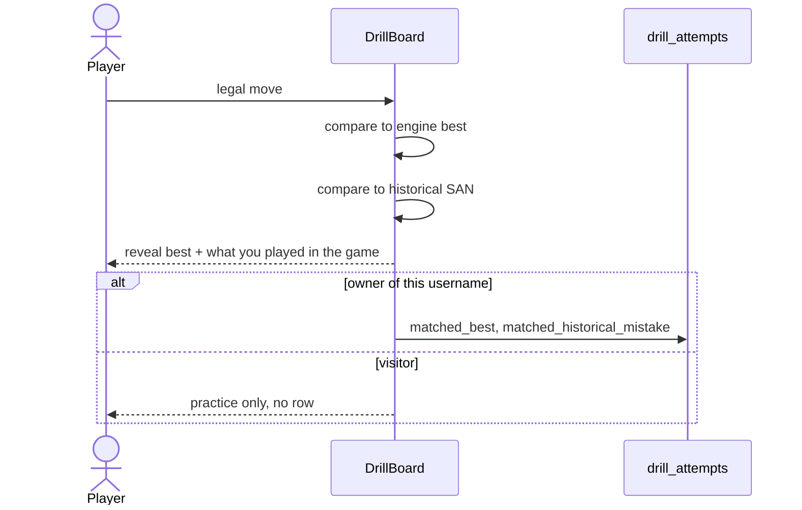

---
tags:
  - audience/human
  - domain/practice
aliases:
  - Drills
---

# Practice

Guess-before-reveal on **your** leaked positions. The engine best move and the historical move stay hidden until a legal move is committed.

## Owns

- `src/components/DrillBoard.tsx`, `PositionsTable.tsx`
- `src/routes/drill.$username.tsx`, `positions.$username.tsx`
- `drill_attempts` table

## Depends on

[[Analysis]] (leak tier) · [[Persistence]] · [[Shared]] (legalMoves, FittedBoardFrame)

## Corpus

Only persisted inaccuracy / mistake / blunder. Brilliant, great, book never enter the table.

Identity of a position: `(username, game_link, move_number)`.

Clicking another friendly piece **switches selection** (Chess.com / Lichess), it does not try to capture your own piece.

Positions → Drill keeps table filters in the deep link.
