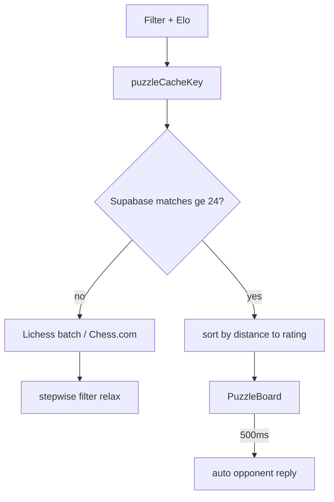

---
tags:
  - audience/human
  - domain/puzzles
---

# Puzzles

Tactics at an Elo window. Catalog is a merge of Supabase, a static Lichess seed, on-demand Lichess batches, and Chess.com puzzles.

## Owns

- `src/lib/puzzles/*`
- `src/components/PuzzleBoard.tsx`, `PuzzleFilterTiles.tsx`
- `src/routes/puzzles.$username.tsx`
- `puzzles` table (public read, service-role write)
- scripts: `puzzles:seed`, `puzzles:download`, `puzzles:import-full`

## Depends on

[[Chess.com]] (rating) · [[Persistence]] · [[Analysis]] (phase thresholds)

## Fit

Default Elo-suited window, plus easier / harder. Weakness focus uses the user's highest-error phase only when that phase has ≥ 6 analyzed moves.

Phase: prefer Lichess themes, else FEN-only fallback sharing [[Analysis]] cutoffs — no chess.js in that fallback.
