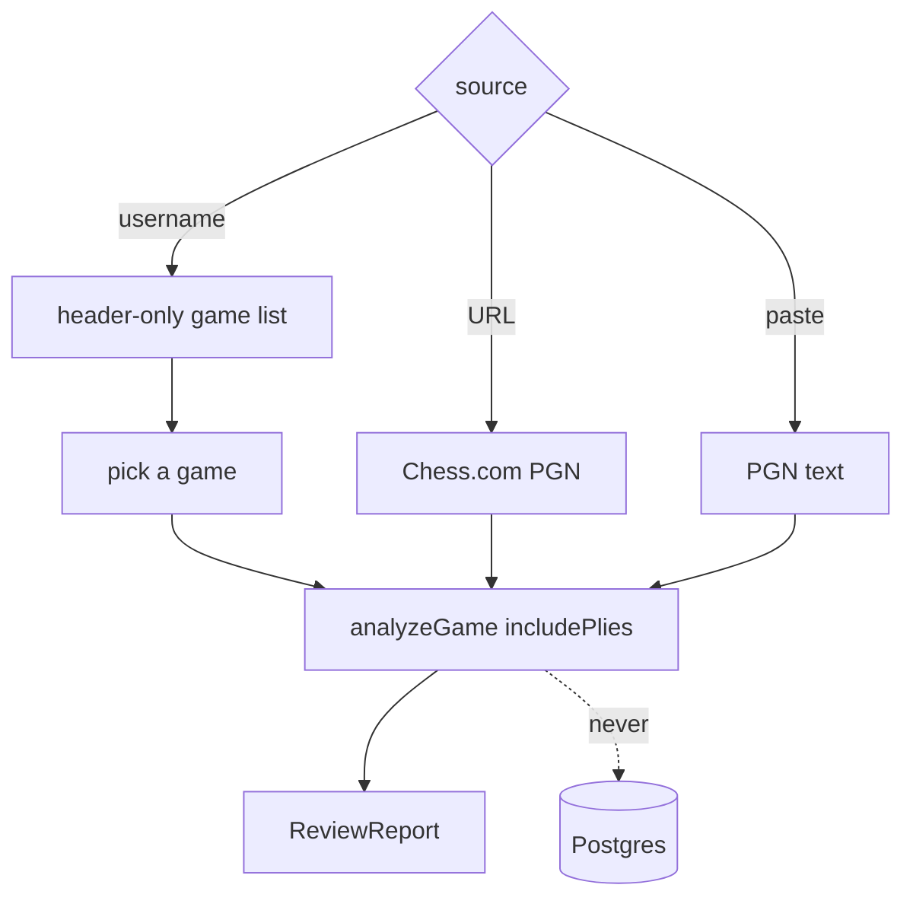

---
tags:
  - audience/human
  - domain/review
aliases:
  - Game review
---

# Review

Free Chess.com-style game review. Analyze a selected game, a URL, or pasted PGN **in memory**. The UI states it plainly: nothing is written to the database.

## Owns

- `src/routes/review.tsx`, `review.index.tsx`, `review.$username.tsx`
- `src/components/review/*`
- `src/lib/analysis/parseGameMeta.ts`, `reportStats.ts`

## Depends on

[[Chess.com]] · [[Analysis]] (`includePlies`) · [[Shared]] (review control classes)

## Differences from library analysis

| Library sync | Review |
| --- | --- |
| 12k-node budget | ~60ms movetime |
| No ply tape stored | Full tape in RAM |
| Leak flags persisted | Nothing persisted |
| Real peer RPCs on Results | Synthetic 5–95 percentile in `reportStats` |

If pasted PGN has no matching username, ask for a color and rewrite headers so identity still works.

Do not reuse Review percentile on Results charts.
