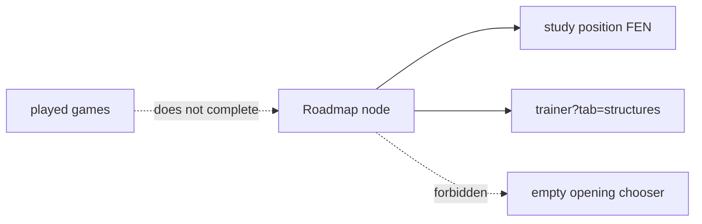

---
tags:
  - audience/human
  - domain/roadmap
---

# Roadmap

Named chess topics with real study positions. Playing games does **not** mark a node done. Practice must open a board (canonical FEN) or the matching structure lab — never an empty opening trainer.

## Owns

- `src/lib/roadmap/topics.ts`, `study.ts`, `progress.ts`
- `src/components/ChessRoadmap.tsx`
- `src/routes/roadmap.$username.tsx`

## Depends on

[[Openings]] (structure lab) · [[Insights]] (optional stats, not completion)

Strategy and Endgame nodes carry positions you can actually play. A card with nowhere to go is a dead card.
