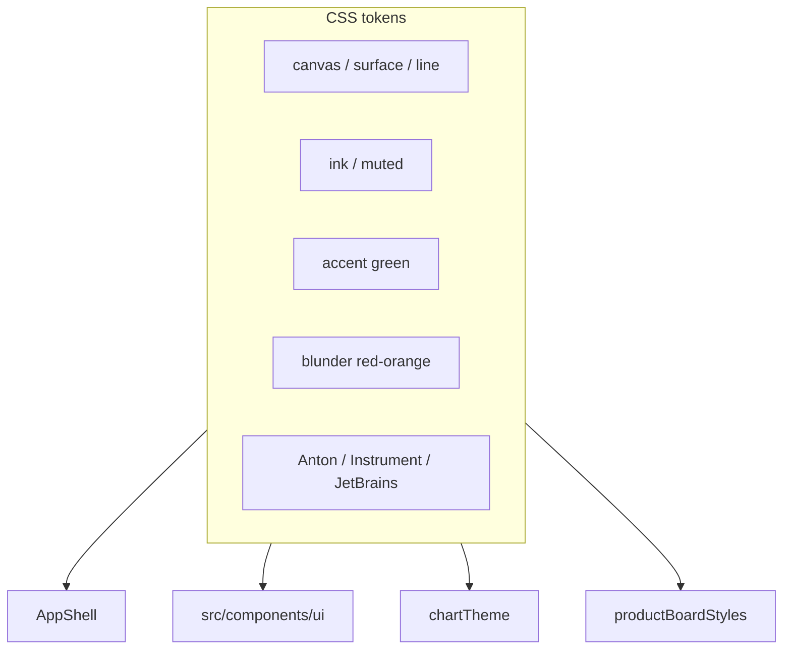

---
tags:
  - audience/human
  - domain/shared
aliases:
  - UI shell
  - Design system
---

# Shared

Chrome, tokens, boards, queries. Every logged-in surface should feel like the same training room.

## Owns

- `src/components/AppShell.tsx`, `src/components/ui/*`
- `src/styles.css` tokens
- `src/lib/queries.ts`, `playerCache.ts`, `idbCache.ts`
- `src/lib/legalMoves.ts`, `boardTheme.ts`, `chartTheme.ts`
- `src/components/FittedBoardFrame.tsx`

## Depends on

[[Platform]] · [[Identity]] (avatar + owner chrome)

## Visual system

Near-black canvas, charcoal surfaces, paper text, green action, bone secondary, red-orange danger. Anton display, Instrument Sans body, JetBrains Mono utility. Sharp corners.

Charts reuse that language: green = improvement, red-orange = harm, bone = secondary series, square caps, visible markers. No soft gradient charts.

## Layout rules

Phone column is the default. `sm` / `md` / `lg` add room. Controls ≥ 44px. `viewport-fit=cover` + safe-area insets. Dense board pages: `100dvh`, no footer, board sized from the **smaller leftover dimension** (`FittedBoardFrame`).

Analysis nav is one horizontally scrolling row. Do not wrap six links.

Press-scale on normal buttons only — not quiet, list, or review rows.

## Queries

Global React Query: 30s stale, no refetch on focus. Player library queries force fresh on mount/focus so Sync now is visible.
