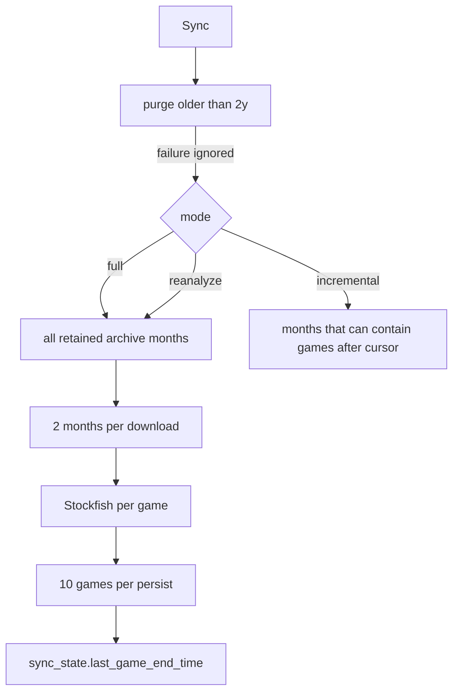

---
tags:
  - audience/human
  - domain/sync
aliases:
  - Library ingest
---

# Sync

Turns a Chess.com library into analyzed `games` + `flagged_positions`. Browser does the heavy pass. Cron only walks games newer than the cursor.

## Owns

- `src/lib/sync/plan.ts`, `runSync.ts`
- `src/lib/backgroundSync.tsx`, `src/routes/analyze.$username.tsx`
- `src/routes/api/sync-user.ts`
- `sync_state` table, `purge_expired_games`

## Depends on

[[Chess.com]] · [[Analysis]] · [[Persistence]] · [[Identity]] (owner only)

## Modes

| Mode | Months | Rows |
| --- | --- | --- |
| `full` | Retention window | New games |
| `incremental` | Months that may contain newer games | New games after cursor |
| `reanalyze` | Same months as full | Caller picks stale `analysis_version` |

Incremental passes `cutoff - 1` into Chess.com because their filter is exclusive `>`.

Cron: stop around `MAX_SYNC_MS` (8s default); if there is no cursor, scan at most two months.
