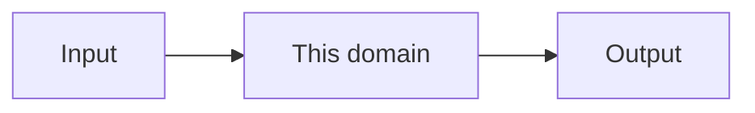

---
tags:
  - template
aliases:
  - Domain template
---

# {{title}}

One-screen domain note. Duplicate this file into `humans/_name/`. Keep the filename unique (`Analysis.md`, not a second `Overview.md`).

## Job

What this domain is for. One paragraph.

## Owns

- Routes
- Tables
- Folders under `src/`

## Depends on

[[Shared]] · …

## Diagram

## Invariants

- Must …
- Must not …

## Decisions

Link [[Decision log]] or add a local table.

## Code

| Path | Role |
| --- | --- |
| `src/...` | |
